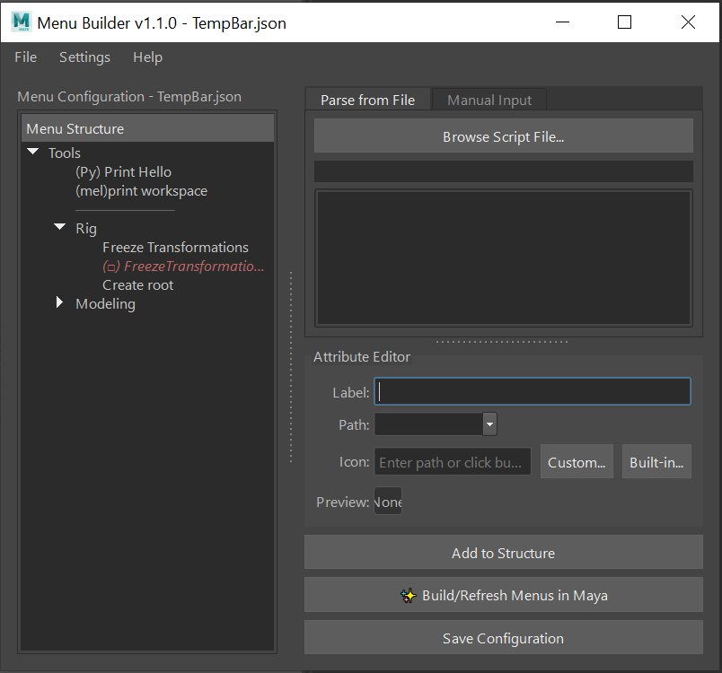
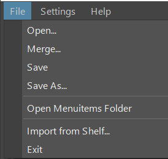

<p align="center">
  <strong>English</strong> | <a href="./README-zh-TW.md">繁體中文</a> | <a href="./README-ja-JP.md">日本語</a>
</p>

# Menu Builder for Maya

**A visual Maya menu editing and management tool designed for 3D artists and project TAs.**

## Introduction

`menubuilder` aims to solve the challenge Maya users face (especially in team projects) in managing a growing collection of external scripts and tools. The traditional Shelf becomes cluttered as the number of tools increases, and manually writing menu scripts presents a high barrier for artists.




This tool provides an intuitive graphical interface, allowing users to easily integrate scattered Python/MEL scripts into Maya's main menu bar. It also facilitates the creation, sharing, and deployment of standardized toolsets for an entire team.

## Key Features

* **Visual Editing:** Intuitively preview and adjust the menu hierarchy and order through a tree view.
* **Drag-and-Drop Sorting:** Directly drag and drop items in the tree view for "what you see is what you get" (WYSIWYG) sorting.
* **Quick Operations:** Quickly modify and organize the menu structure through double-clicking to edit, using the right-click context menu, and direct renaming.
* **Option Boxes:** Easily create and manage standard Maya option boxes via the right-click context menu.
* **Separators:** Easily create and manage standard Maya separators via the right-click context menu.
* **Script Parsing:** Automatically parses `.py` files to list all available functions, simplifying the process of adding commands.
* **Import from Shelf:** Automatically parses `shelf` files and converts them into menus.
* **Command Integration:** Supports both Python and MEL languages and includes a feature for test execution.
* **Icon Selector:** Built-in Maya icon browser and local file browser to easily add icons to your tools with a live preview.
* **File Management:** Supports opening, merging, and saving different menu configuration files (`.json`) for easy management.
* **Team Deployment:** Provides a lightweight startup script that allows team members to automatically generate menus upon Maya's launch without needing to open the editor.

## Installation and Usage

### **A) Opening the Editor**

This process is for creating and editing menu configuration files.

1.  **Place the Project:** Download `menubuilder`, remove the `-main` suffix, and place the entire `menubuilder` folder into one of Maya's python script paths (e.g., `C:/Users/<Username>/Documents/maya/scripts`).
2.  **Launch and Develop:** Execute the following commands in the Python Script Editor:
    ```python
    import menubuilder
    
    # Launch the editor
    menubuilder.show()
    
    # --- For Development ---
    # After modifying the menubuilder source code,
    # you can reload all modules without restarting Maya by running:
    menubuilder.reload()
    menubuilder.show()
    ```

### **B) Automatic Generation (Deployment)**

Deploy a configured menu to be generated automatically when Maya starts.

1.  **Preparation:**
    * Use the `menubuilder` editor to save your desired menu configuration as a `.json` file (e.g., `project_menu.json`).
     
    * Open `settings.json` and ensure the value of `"menuitems"` is the filename you want the team to load by default (e.g., `"menuitems": "project_menu"`).
    * Find or create the `userSetup.py` file, located at:
        `C:/Users/<Username>/Documents/maya/scripts/userSetup.py`
    * Add the following code to `userSetup.py`, and **ensure the paths are correct**:

    ```python
    # maya/scripts/userSetup.py
    import maya.cmds as cmds
    import sys
    import os

    try:
        # --- Menubuilder Auto-Load ---
        # Use evalDeferred to ensure menu generation runs after Maya has fully started
        cmds.evalDeferred("from menubuilder import setup_maya_menu; setup_maya_menu.build_menus_on_startup()")
            
    except Exception as e:
        cmds.warning(f"[Menubuilder Startup] Failed to load menus: {e}")
    # --- End Menubuilder ---
    ```
    

2.  **Completion:** The next time users start Maya, the menu you configured will be generated automatically.

## Menubuilder Framework Guide

### File Structure

```
menubuilder/
├── __init__.py           # Main entry point (contains reload, show)
├── setup_maya_menu.py    # Startup script for team deployment
├── README.md             # Documentation
├── settings.json         # Global settings for the tool
│
├── core/                 # Core function modules
│   ├── handlers/         # Helper modules
│   ├── languagelib/      # Language module
│   ├── controller.py     # Controller (core logic)
│   ├── ui.py             # UI definition
│   ├── data_handler.py   # Data handling (read/write .json)
│   ├── menu_generator.py # Maya menu generator
│   ├── script_parser.py  # Script parser
│   ├── dto.py            # Data Transfer Object (MenuItemData)
│   └── logger.py         # Logging system
│
├── docs/                 # Non-English documentation
│
└── menuitems/            # Stores all menu configuration files (.json)
    └── TempBar.json      # Default test menu configuration
```

## UI Layout

### Menu Bar:

**File**

* Open / Import / Save / Save As
* Open Menu Data Folder
* Import Shelf
  
  

**Setting**

* Language Switch ( Supported Languages: English, Traditional Chinese, Japanese)
* Log Mode
* Default Menu

### Left Panel: Menu Structure

**Tree View (Menu Structure):**

* Drag and drop items to sort or change their hierarchy.
* Right-click an item for structural operations like adding an item/separator/option box or deleting.
  
  

* Double-click an item to load its properties in the right-side panel for editing. Press ESC to exit edit mode directly.
* Double-click a folder item or press F2 to rename it.

   

### Right Panel: Attribute Editing

**Command Source (Input Tabs):**

* **Parse from File:** Allows you to browse and read a `.py` script. The tool will automatically list all functions within it for quick selection.
* **Manual Command Entry:** For directly pasting or writing Python or MEL script commands.

**Command Editing Area:**

* **Command Type:** Choose whether your input command is Python or MEL.
* **Command Input Box:** Write or paste the specific code you want the menu item to execute.
* **Test Execute Button:** Immediately run the command in the input box without generating the menu. View the results or error messages in Maya's Script Editor for easy debugging.

**Attribute Editor:**

* **Label:** Defines the name of the menu item as it appears in Maya.
* **Path:** Defines the hierarchy where the menu item is located, separated by `/` (e.g., `Tools/Rigging`). If left empty, it will be a top-level menu.
* **Icon:** Assign an icon to the menu item. Click "Custom..." to browse for local images or "Built-in..." to browse Maya's internal icon library.

**Preview and Save**

* **Preview in Maya:** Click the "✨ Generate/Refresh Menu in Maya" button at the bottom. Menubuilder will automatically clear old custom menus and generate new ones at the top of Maya's main window based on your current settings. You can click this button at any time to preview your changes.
* **Save Configuration:** When you are satisfied with the layout, click the "Save Configuration" button in the bottom right. All changes will be written to the `.json` file.