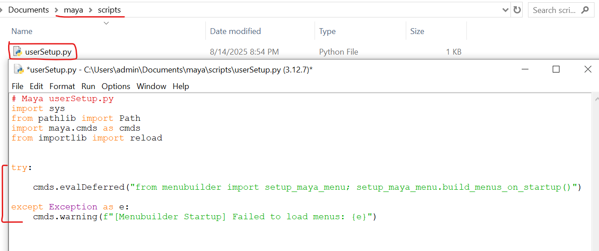
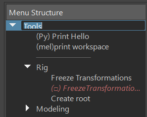

<p align="center">
  <a href="../README.md">English</a> | <a href="./README-zh-TW.md">繁體中文</a> | <strong>日本語</strong>
</p>

# Menu Builder for Maya

**3DアーティストとプロジェクトTA（テクニカルアーティスト）向けに設計された、Mayaのメニューを視覚的に編集・管理するためのツールです。**

## 概要

`menubuilder` は、Mayaユーザー（特にプロジェクトチーム）が増え続ける外部スクリプトやツールの管理に直面する課題を解決することを目指しています。従来のシェルフはツールの数が増えるにつれて乱雑になり、手動でのメニュースクリプト作成はアーティストにとってハードルが高いものでした。


このツールは直感的なグラフィカルインターフェースを提供し、ユーザーが散在するPython/MELスクリプトをMayaのメインメニューバーに簡単に統合できるようにします。また、チーム全体で標準化されたツールセットを容易に作成、共有、導入することも可能です。

## 主な機能

* **ビジュアル編集:** ツリービューを通じて、メニューの階層と順序を直感的にプレビュー・調整できます。
* **ドラッグ＆ドロップによる並べ替え:** ツリービュー内で項目を直接ドラッグ＆ドロップし、「見たまま」の順序変更が可能です。
* **ショートカット操作:** ダブルクリックによる編集、右クリックメニュー、直接リネームなどの方法で、メニュー構造を素早く修正・整理できます。
* **オプションボックス:** 右クリックメニューから、Maya標準のオプションボックス機能を簡単に作成・管理できます。
* **区切り線:** 右クリックメニューから、Maya標準の区切り線を簡単に作成・管理できます。
* **スクリプト解析:** `.py`ファイルを自動的に解析し、利用可能なすべての関数をリストアップして、コマンドの追加を簡素化します。
* **シェルフからインポート:** `shelf`ファイルを自動的に解析し、メニューに変換します。
* **コマンド統合:** PythonとMELの両言語をサポートし、テスト実行機能も提供します。
* **アイコンセレクター:** Maya内蔵のアイコンブラウザとローカルファイルの参照機能を備え、ツールにアイコンを簡単に追加し、リアルタイムでプレビューできます。
* **ファイル管理:** 異なるメニュー設定ファイル（`.json`）のオープン、マージ、名前を付けて保存をサポートし、管理を容易にします。
* **チームでの導入:** 軽量な起動スクリプトを提供し、チームメンバーがエディタを開くことなく、Mayaの起動時に自動でメニューを生成できるようにします。

## インストールと使用方法

### **A) エディタを開く**

この手順は、メニュー設定ファイルの作成と編集に使用します。

1.  **プロジェクトの配置:** `menubuilder` をダウンロードした後、 `-main` の接尾辞を削除し、`menubuilder` フォルダ全体をMayaのPythonパスに配置します（例: `C:/Users/<ユーザー名>/Documents/maya/scripts`）。
2.  **起動と開発:** Pythonスクリプトエディタで以下のコマンドを実行します：
    ```python
    import menubuilder
    
    # エディタを起動
    menubuilder.show()
    
    # --- 開発者向け ---
    # menubuilderのソースコードを修正した後、
    # Mayaを再起動せずに、以下のコマンドを実行してすべてのモジュールをリロードできます
    menubuilder.reload()
    menubuilder.show()
    ```

### **B) 自動生成（導入）**

設定済みのメニューを導入し、Mayaの起動時に自動的にメニューが生成されるようにします。

1.  **準備:**
    * `menubuilder` エディタを使用して、必要なメニュー設定を `.json` ファイル（例: `project_menu.json`）として保存します。
     
    * `settings.json` を開き、`"menuitems"` の値がチームでデフォルトで読み込みたいファイル名になっていることを確認します（例: `"menuitems": "project_menu"`）。
    * `userSetup.py` ファイルを見つけるか、作成します。場所：
        `C:/Users/<ユーザー名>/Documents/maya/scripts/userSetup.py`
    * `userSetup.py` に以下のコードを追加し、**パスが正しいことを確認してください**：

    ```python
    # maya/scripts/userSetup.py
    import maya.cmds as cmds
    import sys
    import os

    try:
        # --- Menubuilder Auto-Load ---
        # evalDeferredを使用して、Mayaが完全に起動した後にメニュー生成が実行されるようにする
        cmds.evalDeferred("from menubuilder import setup_maya_menu; setup_maya_menu.build_menus_on_startup()")
            
    except Exception as e:
        cmds.warning(f"[Menubuilder Startup] Failed to load menus: {e}")
    # --- End Menubuilder ---
    ```
    

2.  **完了:** ユーザーが次にMayaを起動すると、設定したメニューが自動的に生成されます。

## Menubuilderフレームワークガイド

### ファイル構造

```
menubuilder/
├── __init__.py           # メインエントリーポイント (reload, showを含む)
├── setup_maya_menu.py    # チーム導入用の起動スクリプト
├── README.md             # ドキュメント
├── settings.json         # ツールのグローバル設定
│
├── core/                 # コア機能モジュール
│   ├── handlers/         # 補助モジュール
│   ├── languagelib/      # 言語モジュール
│   ├── controller.py     # コントローラー (コアロジック)
│   ├── ui.py             # UI定義
│   ├── data_handler.py   # データ処理 (.jsonの読み書き)
│   ├── menu_generator.py # Mayaメニュー生成
│   ├── script_parser.py  # スクリプトパーサー
│   ├── dto.py            # データ転送オブジェクト (MenuItemData)
│   └── logger.py         # ログシステム
│
├── docs/                 # 英語以外のドキュメント
│
└── menuitems/            # すべてのメニュー設定ファイル (.json) を格納
    └── TempBar.json      # デフォルトのテスト用メニュー設定
```

## UIレイアウト

### メニューバー:

**File**

* 開く / インポート / 保存 / 名前を付けて保存
* メニューデータフォルダを開く
* シェルフをインポート
  
  

**Setting**

* 言語切り替え,デフォルト:英語 (対応言語 : 日本語 , 繁体字中国語 , 英語 )
* ログモード
* デフォルトメニュー

### 左側：メニュー構造パネル

**ツリービュー (Menu Structure):**

* 項目をドラッグして、順序や階層を変更します。
* 項目を右クリックして、項目/区切り線/オプションボックスの追加や削除などの構造的な操作を行います。
  
  

* 項目をダブルクリックすると、右側のパネルにそのプロパティが読み込まれ、編集できます。ESCキーで直接編集を終了します。
* フォルダ項目をダブルクリックするか、F2キーを押すと名前を変更できます。

   

### 右側：属性編集パネル

**コマンドソース (Input Tabs):**

* **ファイルから解析:** `.py` スクリプトを参照して読み込むことができます。ツールが自動的にその中のすべての関数をリストアップし、素早く選択できます。
* **手動でコマンドを入力:** PythonまたはMELのコマンドスクリプトを直接貼り付けたり、記述したりするために使用します。

**コマンド編集エリア:**

* **コマンドタイプ:** 入力したコマンドがPythonかMELかを選択します。
* **コマンド入力ボックス:** メニューに実行させたい具体的なコードを記述または貼り付けます。
* **テスト実行ボタン:** メニューを生成せずに、入力ボックス内のコマンドを即座に実行し、Mayaのスクリプトエディタで結果やエラーメッセージを確認して、デバッグを容易にします。

**アトリビュートエディタ:**

* **ラベル (Label):** Mayaで表示されるメニュー項目の名前を定義します。
* **パス (Path):** メニュー項目が配置される階層を `/` で区切って定義します（例: `Tools/Rigging`）。空欄の場合は、トップレベルメニューになります。
* **アイコン (Icon):** メニュー項目にアイコンを指定します。「カスタム...」をクリックしてローカルの画像を参照するか、「内蔵...」をクリックしてMaya内蔵のアイコンライブラリを参照します。

**プレビューと保存**

* **Mayaでプレビュー:** 最下部にある「✨ Mayaでメニューを生成/更新」ボタンをクリックします。Menubuilderは古いカスタムメニューを自動的にクリアし、現在の設定に基づいてMayaのメインウィンドウ上部に新しいメニューを生成します。いつでもこのボタンをクリックして変更内容をプレビューできます。
* **設定ファイルを保存:** レイアウトに満足したら、右下の「設定を保存」ボタンをクリックします。すべての変更が `.json` ファイルに書き込まれます。