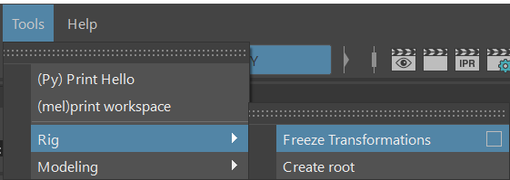
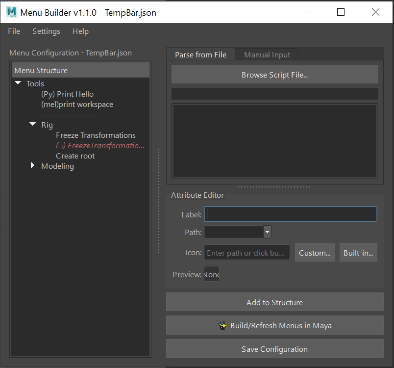
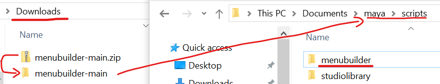
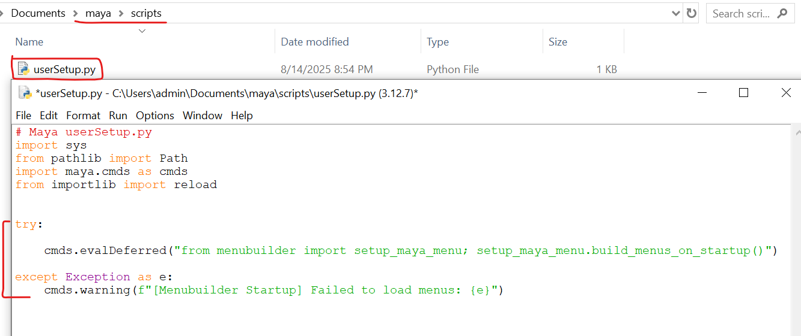
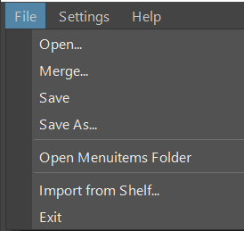
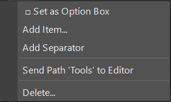
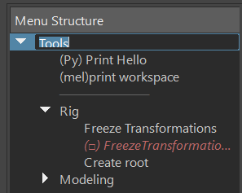

<p align="center">
  <a href="../README.md">English</a> | <strong>繁體中文</strong> | <a href="./README-ja-JP.md">日本語</a>
</p>

# Menu Builder for Maya

**一個為 3D 美術師與專案 TA 設計的、視覺化的 Maya 菜單編輯與管理工具。**

## 介紹

`menubuilder` 旨在解決 Maya 使用者（特別是在專案團隊中）管理日益增長的外部腳本和工具的難題。傳統的 Shelf 工具架在工具數量增多時會變得混亂不堪，而手動編寫菜單腳本對美術師來說門檻過高。




本工具提供了一個直觀的圖形介面，讓使用者可以輕鬆地將零散的 Python/MEL 腳本整合到 Maya 的主菜單欄中，並能方便地為整個團隊建立、分享和部署標準化的工具集。

## 主要功能

* **視覺化編輯:** 透過樹狀圖直觀地預覽和調整菜單的層級與順序。
* **拖放排序:** 直接在樹狀視圖中拖放項目，實現「所見即所得」的排序。
* **快捷操作:** 透過雙擊編輯、右鍵選單、直接重命名等方式快速修改和組織菜單結構。
* **選項框:** 透過右鍵選單、輕鬆創建和管理 Maya 標準的選項框功能。
* **分格線:** 透過右鍵選單、輕鬆創建和管理 Maya 標準的分隔線功能。
* **腳本解析:** 自動解析 `.py` 檔案，列出所有可用函式，簡化指令的添加。
* **Shelf滙入:** 自動解析 `shelf` ,轉化成菜單。
* **指令整合:** 支援 Python 和 MEL 兩種語言，並提供測試執行功能。
* **圖示選擇器:** 內建 Maya 圖示瀏覽器和本地檔案瀏覽功能，輕鬆為您的工具添加圖示和即時預覽。
* **檔案管理:** 支援開啟、合併、另存為不同的菜單設定檔 (`.json`)，方便管理。
* **團隊部署:** 提供輕量級的啟動腳本，讓團隊成員無需開啟編輯器即可在 Maya 啟動時自動生成菜單。

## 安裝與使用

### **A) 開啟編輯器**

這個流程用於創建和編輯菜單設定檔。

1.  **放置專案:** 下載 `menubuilder` 後移除後綴 `-main`, 將 `menubuilder` 整個資料夾放置到Maya的python路徑下。(如: `C:/Users/<使用者名稱>/Documents/maya/scripts`)
       
2.  **啟動與開發:** 在 Python Script Editor 中執行以下指令：
    ```python
    import menubuilder
    
    # 啟動編輯器
    menubuilder.show()
    
    # --- 開發 ---
    # 當您修改了 menubuilder 的原始碼後，
    # 無需重啟 Maya，只需執行以下指令來重載所有模組
    menubuilder.reload()
    menubuilder.show()
    ```

### **B) 自動生成 (部署)**

部署配置好的菜單，在啟動 Maya 時會自動生成菜單。

1.  **準備:**
    * 使用 `menubuilder` 編輯器，將所需的菜單配置儲存為一個 `.json` 檔案（例如 `project_menu.json`）。
    * 打開 `settings.json`，確保 `"menuitems"` 的值是您希望團隊預設載入的檔名（例如 `"menuitems": "project_menu"`）。
    * 找到或創建 `userSetup.py` 檔案，它位於：
        `C:/Users/<使用者名稱>/Documents/maya/scripts/userSetup.py`
    * 在 `userSetup.py` 中加入以下程式碼，並**確保 `project_folder_path` 指向正確的路徑**：

    ```python
    # maya/scripts/userSetup.py
    import maya.cmds as cmds
    import sys
    import os

    try:
        # --- Menubuilder Auto-Load ---
        # 使用 evalDeferred 確保在 Maya 完全啟動後才執行菜單生成
        cmds.evalDeferred("from menubuilder import setup_maya_menu; setup_maya_menu.build_menus_on_startup()")
            
    except Exception as e:
        cmds.warning(f"[Menubuilder Startup] Failed to load menus: {e}")
    # --- End Menubuilder ---
    ```
    

1.  **完成:** 使用者下次啟動 Maya 時，就會自動生成您配置好的菜單。

## Menubuilder 框架指南

### 檔案結構

```
menubuilder/
├── __init__.py           # 主入口點 (包含 reload, show)
├── setup_maya_menu.py    # 團隊部署用的啟動腳本
├── README.md             # 說明文件
├── settings.json         # 工具的全域設定
│
├── core/                 # 核心功能模組
│   ├── handlers/         # 輔助模組
│   ├── languagelib/      # 語言模組
│   ├── controller.py     # 控制器 (核心邏輯)
│   ├── ui.py             # UI 介面定義
│   ├── data_handler.py   # 資料處理 (讀寫 .json)
│   ├── menu_generator.py # Maya 菜單生成器
│   ├── script_parser.py  # 腳本解析器
│   ├── dto.py            # 資料傳輸物件 (MenuItemData)
│   └── logger.py         # 日誌系統
│
├── docs/                 # 非英文本說明文件
│
└── menuitems/            # 存放所有菜單設定檔 (.json)
    └── TempBar.json      # 預設的測試菜單設定
```

## 介面佈局
### 菜單列:
**File**

* 開啟/滙入/存檔/另存
* 開啟菜單資料夾
* 滙入shelf
  
  

**Setting**

* 語言切換，預設英文 (支援: 英/ 中/ 日)
* 日誌模式
* 預設菜單

### 左側：菜單結構面板

**樹狀圖 (Menu Structure)：**

* 拖曳項目來進行排序或變更層級。

* 右鍵點擊項目以進行新增 項目/分隔線/選項框或刪除 等結構性操作。
  
  

* 雙擊項目以在右側面板中載入其屬性進行編輯。ESC直接退出編輯
* 雙擊資料夾項目或按下F2可重新名命

   

### 右側：屬性編輯面板

**指令來源 (Input Tabs)：**

* 從檔案解析：讓您可以瀏覽並讀取一個 .py 腳本，工具會自動列出其中所有的函式，方便您快速選用。

* 手動輸入指令：用於直接貼上或編寫 Python 或 MEL 指令碼。

**指令編輯區：**

* 指令類型：選擇您輸入的指令是 Python 還是 MEL。

* 指令輸入框：編寫或貼上您希望菜單執行的具體程式碼。

* 測試執行按鈕：在不生成菜單的情況下，立即執行輸入框中的指令，並在 Maya 的 Script Editor 中查看結果或錯誤訊息，方便除錯。

**屬性編輯器 (Attribute Editor)：**

* 菜單標籤 (Label)：定義菜單項在 Maya 中顯示的名稱。

* 菜單路徑 (Path)：定義菜單項所在的層級，用 / 分隔（例如 Tools/Rigging）。如果留空，則為頂級菜單。

* 圖示路徑 (Icon)：為菜單項指定一個圖示。可以點擊「自訂...」來瀏覽本機圖片，或點擊「內建...」來瀏覽 Maya 內建的圖示庫。


**預覽與保存**

* 在 Maya 中預覽：點擊最下方的「✨ 在Maya中產生/刷新菜單」按鈕。Menubuilder 會自動清除舊的自訂菜單，並根據您當前的設定在 Maya 主視窗頂部生成全新的菜單。您可以隨時點擊此按鈕來預覽您的修改效果。

* 保存設定檔：當您對佈局感到滿意時，點擊右下的「儲存設定檔」按鈕，所有修改將被寫入 .json 檔案中。


